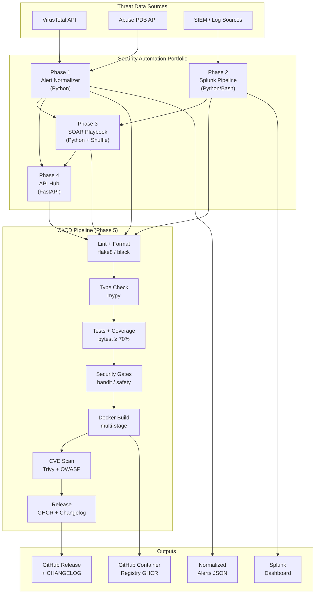

# Security Automation Portfolio

[](https://github.com/oznekcyber/security-automation/actions/workflows/phase1-normalizer.yml)
[](https://github.com/oznekcyber/security-automation/actions/workflows/phase2-splunk-pipeline.yml)
[](https://github.com/oznekcyber/security-automation/actions/workflows/phase3-soar-playbook.yml)
[](https://github.com/oznekcyber/security-automation/actions/workflows/phase4-integration-hub.yml)
[](https://github.com/oznekcyber/security-automation/actions/workflows/security-scan.yml)
[](https://github.com/oznekcyber/security-automation/actions/workflows/release.yml)

A production-grade security automation portfolio built as a monorepo, demonstrating
end-to-end DevSecOps practices: threat intelligence enrichment, log ingestion,
SOAR orchestration, API gateway design, and a CI/CD pipeline that treats security
as a first-class gate — not an afterthought.

---

## Architecture



---

## Phases

| Phase | Name | Description | Status |
|-------|------|-------------|--------|
| **1** | [Security Alert Normalizer](./phase1-normalizer/) | Enriches IPs and file hashes via VirusTotal and AbuseIPDB; outputs a unified JSON schema | ✅ Complete |
| **2** | [Splunk Log Ingestion Pipeline](./phase2-splunk-pipeline/) | Parses and forwards structured security events to Splunk HEC | 🚧 In Progress |
| **3** | [SOAR Incident Response Playbook](./phase3-soar-playbook/) | Automated triage, enrichment, containment, and notification via Shuffle SOAR | 🚧 In Progress |
| **4** | [API Integration Hub](./phase4-integration-hub/) | FastAPI gateway exposing all phases behind a single authenticated API | 🚧 In Progress |
| **5** | [CI/CD Pipeline](./phase5-cicd/) | GitHub Actions workflows, Docker builds, security scanning, and release automation | ✅ Complete |
| **6** | [AWS GuardDuty Integration](./phase6-aws-guardduty/) | Serverless GuardDuty findings processor and automated response | 🔜 Planned |

---

## Quick Start — Full Stack

### Prerequisites

- Docker ≥ 24 and Docker Compose ≥ 2.20
- Python 3.11+ (for local development)
- `make` (GNU Make)

### Clone and run

```bash
git clone https://github.com/oznekcyber/security-automation.git
cd security-automation

# Start the full stack (Phase 4 API available at http://localhost:8000)
docker compose -f docker-compose.full-stack.yml --profile full up -d

# Open the interactive API docs
open http://localhost:8000/docs

# Tail logs
docker compose -f docker-compose.full-stack.yml logs -f

# Stop
docker compose -f docker-compose.full-stack.yml down
```

### Run Phase 1 demo (no API keys required)

```bash
cd phase1-normalizer
pip install -r requirements.txt
python main.py --demo
```

### Run the full CI pipeline locally

```bash
# Install all dependencies
make install

# Run everything CI runs
make ci
```

---

## CI/CD Pipeline

Every pull request and push runs the following gates automatically:

```
Push / PR
    │
    ├── Lint & Format Check    (flake8 + black)
    ├── Type Checking          (mypy)
    ├── Security SAST          (bandit + safety)
    ├── Test Suite             (pytest, coverage ≥ 70%)
    └── Docker Build           (multi-stage, smoke test)

Merge to main
    │
    ├── Semantic Version Tag   (conventional commits)
    ├── Build & Push to GHCR   (all phases)
    ├── Generate CHANGELOG
    └── Create GitHub Release
```

**Security scanning runs on every PR and nightly:**

- 🔍 **Trivy** — Docker image CVE scanning (CRITICAL severity blocks the build)
- 🔑 **detect-secrets** — Hardcoded credential detection
- 🛡️ **OWASP Dependency Check** — Comprehensive dependency vulnerability audit
- ✅ **Credential pattern validation** — Ensures no API keys in source code

---

## Development

### Shared tooling

| Tool | Purpose | Config |
|------|---------|--------|
| [flake8](https://flake8.pycqa.org) | PEP 8 linting | `pyproject.toml` |
| [black](https://black.readthedocs.io) | Code formatting | `pyproject.toml` |
| [mypy](https://mypy.readthedocs.io) | Static type checking | `pyproject.toml` |
| [bandit](https://bandit.readthedocs.io) | Python SAST | `pyproject.toml` |
| [safety](https://pyup.io/safety/) | Dependency CVE audit | — |
| [pytest](https://pytest.org) | Test runner | `pyproject.toml` |
| [pre-commit](https://pre-commit.com) | Git hooks | `.pre-commit-config.yaml` |

### Install pre-commit hooks

```bash
make pre-commit-install
```

This installs hooks that run black, isort, flake8, bandit, and secret detection
automatically before every commit.

### Available make targets

```bash
make help          # List all targets
make install       # Install all dependencies
make lint          # Run linters across all phases
make format        # Auto-format with black + isort
make type-check    # Run mypy
make test          # Run test suites with coverage
make security      # Run bandit + safety
make secrets-scan  # Scan for hardcoded secrets
make docker-build  # Build all Docker images
make up            # Start the full stack
make down          # Stop the full stack
make ci            # Run the full local CI pipeline
make clean         # Remove build artifacts
```

---

## Container Images

All images are published to GitHub Container Registry on every release:

```bash
# Phase 1
docker pull ghcr.io/oznekcyber/phase1-normalizer:latest

# Phase 2
docker pull ghcr.io/oznekcyber/phase2-splunk-pipeline:latest

# Phase 3
docker pull ghcr.io/oznekcyber/phase3-soar-playbook:latest

# Phase 4
docker pull ghcr.io/oznekcyber/phase4-integration-hub:latest
```

---

## Contributing

1. Fork the repository
2. Create a feature branch: `git checkout -b feat/your-feature`
3. Commit using [Conventional Commits](https://www.conventionalcommits.org/): `feat:`, `fix:`, `chore:`, etc.
4. Push and open a Pull Request — CI will run automatically
5. Ensure all checks pass before requesting review

---

## License

MIT — see [LICENSE](./LICENSE) for details.
